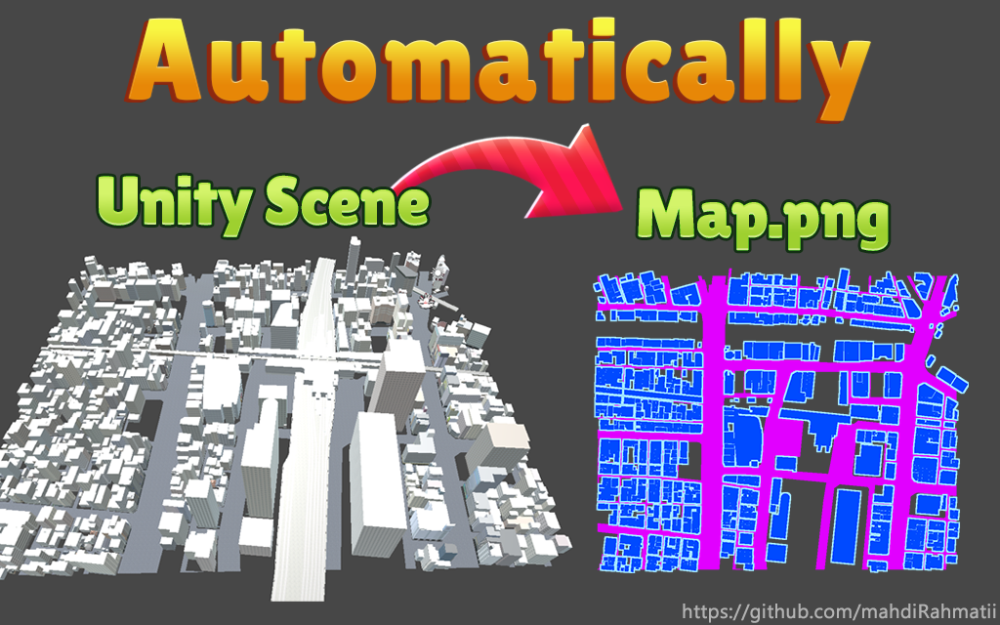
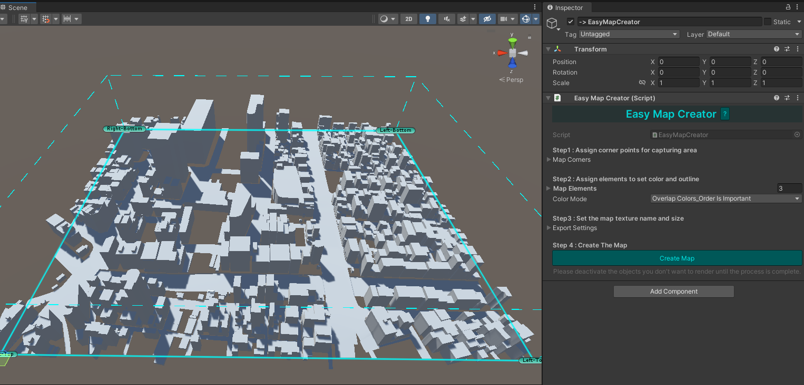

# Unity Easy Map Creator v1.2

  

## Overview

Unity Easy Map Creator is a tool for generating map images from Unity scenes. This tool simplifies the process of creating map.png (transparent) files from your Unity environments, making it easy to visualize and share your game or simulation worlds.
This version is more efficient and faster than the previous version.

## Features

- **Automated Map Generation**: Effortlessly generate detailed map images directly from your Unity scene.
- **Customization**: Adjust settings to customize the appearance of the generated map.
  - **Custom Color**: Choose custom colors to represent different elements in your map.
  - **Outline**: Add outlines to enhance the visibility and aesthetics of map elements.
  - **ColorMode**: You can specify whether the colors of the elements blend together or overlap.
  - **TexturingMode**: You can change the color of the elements or specify that they use their default texture.
  
## Getting Started

### Installation

Clone the repository or Import the package

### Usage

1. Create an object and assign the EasyMapCreator.cs component to it
2. Now follow the steps
#### . 

## Example Scene

Explore the demo scene provided in the Demo folder to see Easy Map Creator in action.