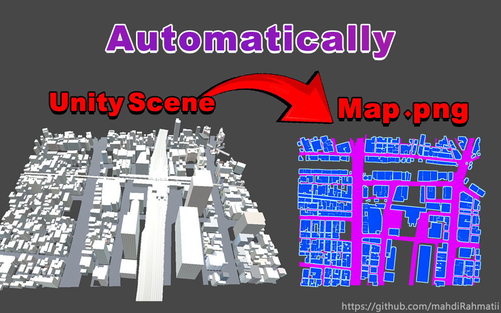
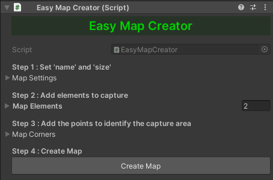

# Unity Easy Map Creator

  

## Overview

Unity Easy Map Creator is a tool for generating map images from Unity scenes. This project simplifies the process of creating map.png files from your Unity environments, making it easy to visualize and share your game or simulation worlds.

## Features

- **Automated Map Generation**: Quickly generate map images based on your Unity scene.
- **Customization**: Adjust settings to customize the appearance of the generated map.
  - **Custom Color**: Choose custom colors to represent different elements in your map.
  - **Outline**: Add outlines to enhance the visibility and aesthetics of map elements.
  
## Getting Started

### Installation

1. Unity [ver.2021 or higher] 
2. Clone the repository.

### Usage

1. Create an object and assign the EasyMapCreator.cs component to it
2. Now follow the steps
#### . 

## Example Scene

Explore the example scene provided in the Examples folder to see Easy Map Creator in action.
